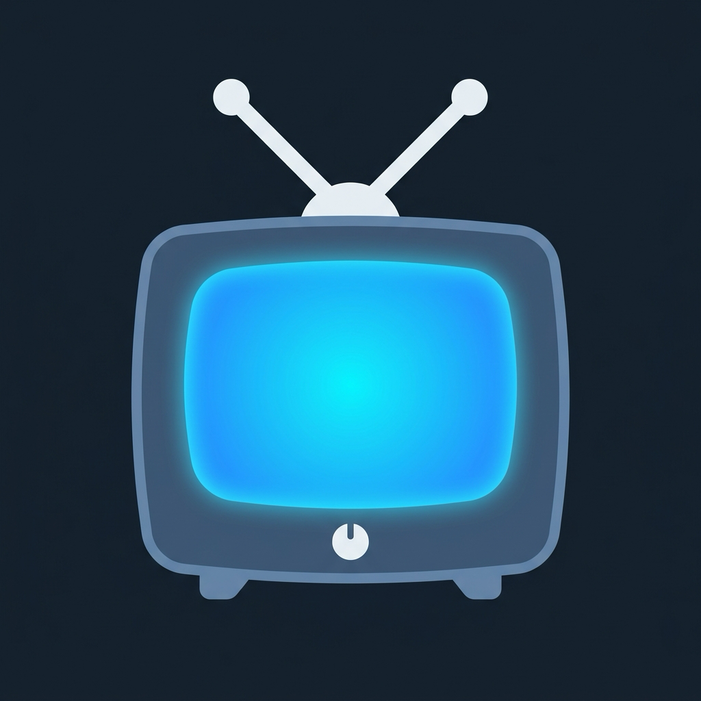
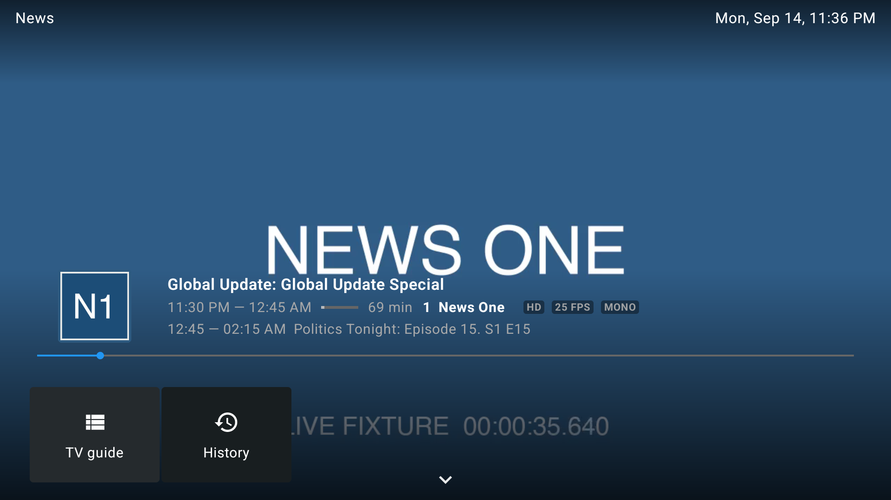
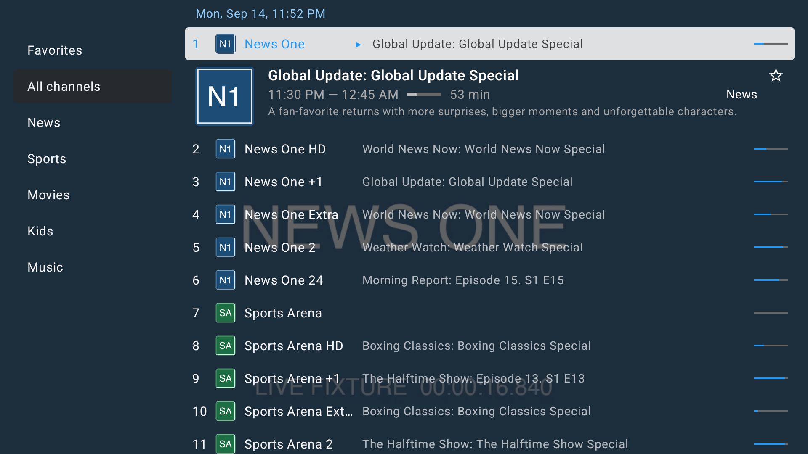
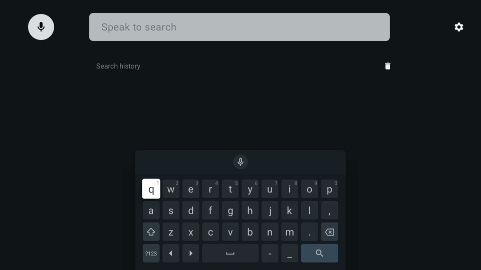
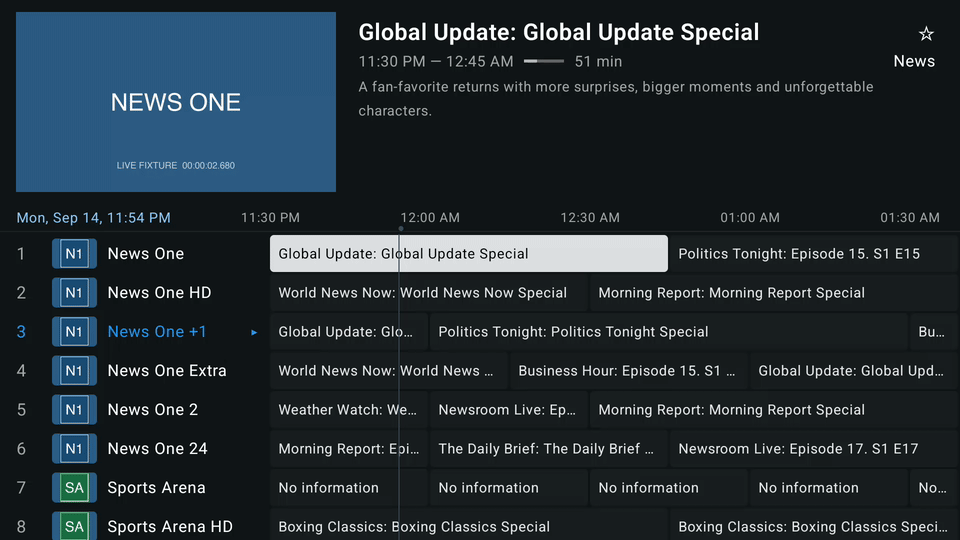
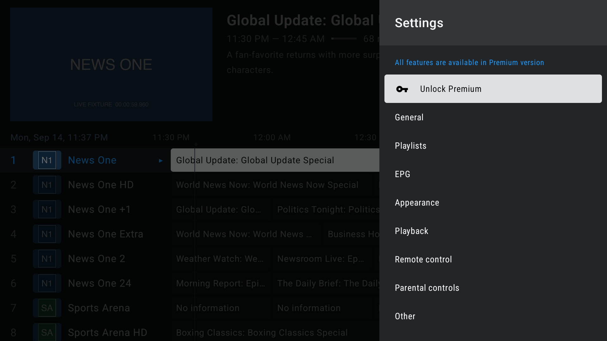
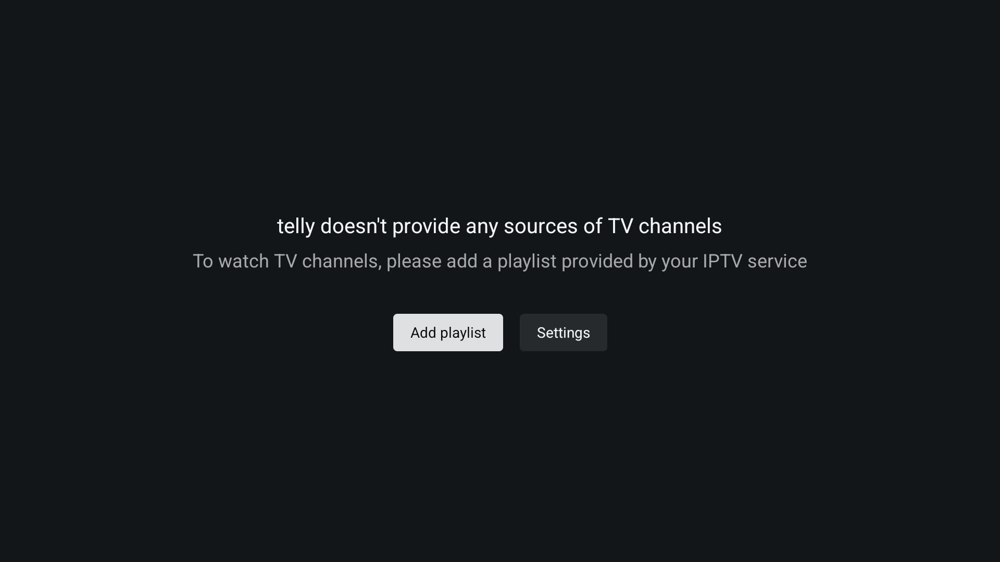

<p align="center">
  
</p>

<h1 align="center">telly</h1>

<p align="center"><b>An open-source, TiviMate-style IPTV player for Android TV.</b></p>

<p align="center">
  
</p>

telly is a native Android TV live-TV app built with Kotlin and Jetpack Compose for
TV. Bring your own M3U playlist and XMLTV EPG and you get a fast, remote-first TV
guide, instant channel zapping, catch-up, DVR recording, VOD, multiview, search,
and a familiar channel-surfing feel. There is no backend and there are no
accounts: everything is fetched on-device and cached locally. There is also no
premium tier — every feature ships free.

> telly is an independent open-source project inspired by TiviMate's UX. It is
> **not affiliated with, endorsed by, or connected to TiviMate** or its developers
> in any way.

## Features

### TV guide

A full timeline grid with live preview, programme details, channel groups, and
day-jumping. Pan the timeline with the D-pad; OK tunes the preview, OK again goes
fullscreen. Programme cells offer Remind, Record, Custom recording, Add to My
list and the programme description; the left nav rail jumps to Search, My List,
Movies (VOD), Recordings and Settings.


### Instant zapping

CH+/CH− (and number entry) zap directly with a TiviMate-style overlay showing the
channel number, current programme and what's next.


### Playback overlays and the quick-bar

OK during playback shows the programme info: times, progress, now/next, and stream
details (resolution, FPS, audio). A second UP reveals the transport row, and the
shortcut row underneath holds TV guide, History, Multiview, one card per recently
watched channel, and Clear. Long-OK opens the quick-bar — all nine slots are
live: Search, Channels list, Recordings, Multiview, Picture-in-picture, a video
track picker, an audio track picker, an audio-sync stepper, and a
subtitle/CC picker.



### Channel list panel

The quick-bar's Channels list opens groups + channels over the dimmed video, with
now-playing info, progress, and an expanded detail card on the focused row.



### Search

Search channels by name or number and programmes by title, with a two-pane
programme browser and search history. OK on a programme row opens the live
actions dropdown — set a reminder, record it, or add it to My List.



### Context menu everywhere

Long-press OK on any channel row for the context sheet: search, settings,
favorites, manage favorites, reorder channels, hide channel, block channel
(PIN-gated), open in external player, programme description and more.



### Catch-up

Channels that advertise catch-up in the playlist (`catchup` attributes) play
already-aired programmes straight from the guide: OK on a past cell starts the
archive with a full seek transport. All five community source types are
supported — default (template), append, shift, flussonic and xtream-codes.

### DVR recording

Record the current programme instantly, schedule one from the guide, or build a
custom recording; captures run in a foreground service with notifications and
land in a recordings library (quick-bar Recordings / the guide rail's DVR icon)
with playback and delete. Raw TS and progressive HTTP streams are copied
byte-for-byte, and **HLS recording is supported**: the media playlist (via the
master's highest-bandwidth variant) is polled per target duration and its
segments concatenated — TS segments into a `.ts` capture, fMP4 renditions
(`#EXT-X-MAP`) into a valid fragmented `.mp4` capture (init segment first).
One honest limitation: the scheduler is in-app only — **scheduled recordings
start only while telly is running** (no alarm-manager wakeups). The settings
pane says so out loud.

### VOD

Movie-style playlist entries are classified into a Movies library (the guide
rail's film icon) with a card browser and seekable playback that remembers your
position and offers resume.

### Multiview

Watch up to four streams at once in a mosaic grid: add, change and remove
screens per pane, D-pad focus moves between panes, and audio always follows the
focused pane. CH+/− zap the focused pane in place.

### Picture-in-picture

Shrink live TV into a system PIP window from the quick-bar, or flip on
**Settings → General → PIP on Home** to enter PIP automatically when you press
HOME during playback.

### My List, reminders and favorites

Save programmes to My List from any programme dropdown and browse them from the
guide rail's bookmark. Reminders fire an in-app popup when the programme is
about to air and are managed under **Settings → Other → Reminders**. Favorites
get their own group plus full management: add/remove from any context sheet,
and dedicated Manage Favorites / Reorder channels screens.

### History

The info overlay's shortcut row shows your recently watched channels as
one-press cards, and the History card opens the full watch log (OK on a row
tunes it; clear-all wipes it). Simplification, on purpose: where the reference
keeps the recent-cards row and the History log as separate stores, telly feeds
both from one `watch_history` table — so clearing one clears the other.

### Settings

A TiviMate-style two-pane settings shell where every pane is real:

- **General** — autostart on boot/wake, last-channel-on-start, PIP on Home,
  confirm exit, global User-Agent, UDP proxy.
- **Playlists** — add/update/delete, per-playlist EPG sources, URL edit,
  per-playlist User-Agent, auto-update, and manage groups (enable/disable
  playlist groups everywhere).
- **EPG** — update intervals, past-days retention, and explicit EPG sources:
  the auto-detected `url-tvg` source plus any number of added XMLTV URLs.
- **Appearance** — accent color themes, clock format, channel numbers, plus TV
  Guide (visible-channels density, transparency), Player (panel transparency,
  timeout, clock), Groups, Logos, language and font size.
- **Playback** — buffer size, decoders, auto frame rate (AFR), surround,
  passthrough, external player hand-off, resize mode and configurable skip
  steps.
- **Remote control** — seek-key behavior and full player/TV-guide keymap
  sub-screens (what OK, UP/DOWN, LEFT/RIGHT and long-OK do in each context).
- **Parental controls** — salted-PIN lock, per-group locking, blocked channels
  (every tune of a blocked channel asks for the PIN first), and PIN-gated
  settings/playlists.
- **Other** — Search history, Reminders, Recording and VOD sub-panes.
- **About** + JSON backup/restore.



### Simple onboarding

First run walks you through adding your playlist URL and confirming the EPG
URL — that's the whole setup.



## Install

Grab the latest APK from [GitHub Releases](../../releases) and sideload it onto
your Android TV device:

```sh
adb install telly-*.apk
```

or use a sideloading app like Downloader. Supports Android 6.0+ (minSdk 23),
including older TV boxes.

Or build from source:

```sh
./gradlew assembleDebug   # APK lands in app/build/outputs/apk/debug/
```

## Getting started

1. Launch telly. On first run it asks for a playlist.
2. Choose **Add playlist → M3U playlist → Enter URL** and type the M3U URL from
   your IPTV provider.
3. If your playlist carries a `url-tvg` hint, the XMLTV EPG is pre-filled into
   the wizard's EPG step; otherwise enter one there or add sources later under
   **Settings → EPG**.
4. That's it — playback starts on channel 1 and BACK brings up the TV guide.

Your URLs never leave the device. Playlist and guide data are fetched directly
(OkHttp) and cached in a local Room database.

## Architecture

- **Native Kotlin + Jetpack Compose for TV** (`androidx.tv:tv-material`) — no
  webviews, no cross-platform layer. Leanback launcher integration, Compose UI.
- **Media3/ExoPlayer** (with HLS) for playback.
- **No backend.** Device-side fetching + Room caching only.
- **Vertical feature slices:** `com.johncorser.telly.features.<slice>` (playlist,
  epg, player, guide, search, settings, recording, catchup, vod, multiview, ...)
  with shared design tokens in `core/`.

## Development

Start with [CLAUDE.md](CLAUDE.md) — the project charter, conventions and decisions
log live there.

```sh
./scripts/install-hooks.sh   # one-time: enable the pre-commit quality gate
./scripts/quality.sh         # run every gate locally (authoritative)
./gradlew assembleDebug      # build a debug APK
```

Requires JDK 17, the Android SDK, and Node.js for the gate scripts.

Every commit must pass the full gate (`./scripts/quality.sh`, enforced by the
pre-commit hook): ktlint + detekt, ≤100 logic lines per file, per-method CRAP ≤ 15,
per-function Halstead difficulty ≤ 20, zero duplication (jscpd), ≥80% line coverage,
and a green build + unit tests. Thresholds are never loosened — the code gets fixed
instead.

Every feature also ships as an executable Gherkin spec under `e2e/features/`
(cucumber-android driving the real app with D-pad events on an Android TV emulator,
against a hermetic in-process fixture server).

## License

No license file yet — one will land with an upcoming tagged release. Until then the
code is source-available on GitHub without an explicit grant.
